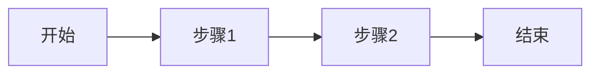

# {产品/模块名称} PRD

## 1. 概述

### 1.1 背景与目标

<!-- 描述为什么要做这个功能/产品，解决什么问题 -->

### 1.2 目标用户

<!-- 描述目标用户群体 -->

### 1.3 成功指标

| 指标 | 目标值 | 衡量方式 |
|------|--------|----------|
| | | |

## 2. 功能需求

### 2.1 功能列表

| 功能模块 | 优先级 | 描述 |
|----------|--------|------|
| | P0/P1/P2 | |

### 2.2 功能详情

#### 2.2.1 {功能名称}

**用户故事**:
> 作为 [角色]，我希望 [行为]，以便 [价值]

**验收标准**:
- [ ] 标准 1
- [ ] 标准 2

**业务规则**:
- 规则 1
- 规则 2

## 3. 非功能需求

### 3.1 性能要求

| 场景 | 指标 | 要求 |
|------|------|------|
| 响应时间 | | < 200ms |
| 并发量 | | |

### 3.2 安全要求

- [ ] 数据加密
- [ ] 权限控制
- [ ] 审计日志

### 3.3 兼容性要求

| 类型 | 要求 |
|------|------|
| 浏览器 | Chrome 90+, Safari 14+ |
| 移动端 | iOS 14+, Android 10+ |

## 4. 用户体验

### 4.1 交互流程

<!-- 可以用 Mermaid 图或文字描述 -->

### 4.2 界面原型

<!-- 附上原型图或链接 -->

## 5. 数据需求

### 5.1 数据模型

<!-- 描述核心数据实体和关系 -->

### 5.2 数据来源

| 数据项 | 来源 | 获取方式 |
|--------|------|----------|
| | | |

## 6. 依赖与风险

### 6.1 外部依赖

| 依赖项 | 负责方 | 风险评估 |
|--------|--------|----------|
| | | |

### 6.2 风险评估

| 风险 | 影响 | 概率 | 缓解措施 |
|------|------|------|----------|
| | 高/中/低 | 高/中/低 | |

## 7. 里程碑

| 阶段 | 交付物 | 截止日期 | 负责人 |
|------|--------|----------|--------|
| 技术方案 | 技术设计文档 | | |
| 开发 | 功能完成 | | |
| 测试 | 测试报告 | | |
| 上线 | 生产环境部署 | | |

## 8. 附录

### 8.1 术语表

| 术语 | 定义 |
|------|------|
| | |

### 8.2 参考文档

- [相关文档链接]

### 8.3 变更历史

| 版本 | 日期 | 变更内容 | 作者 |
|------|------|----------|------|
| 1.0 | | 初始版本 | |
