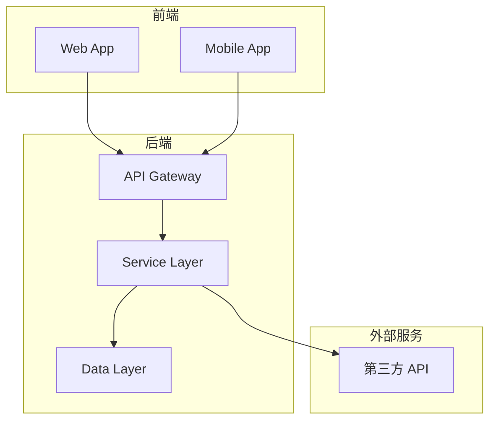
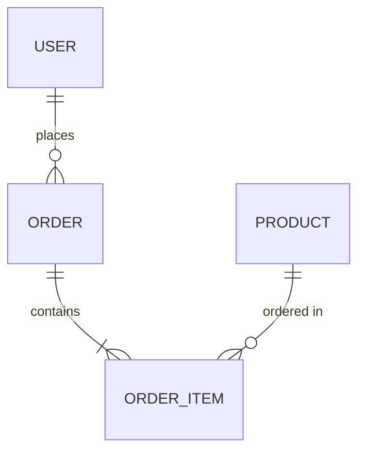
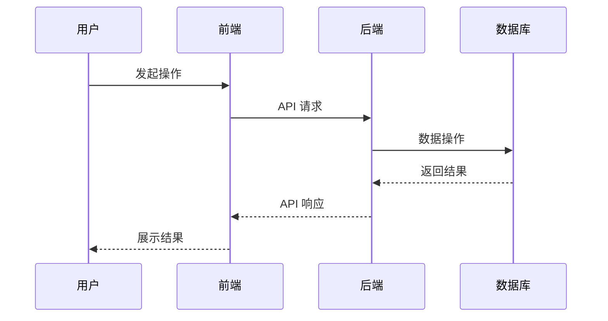

# {模块名称} 技术方案

## 1. 概述

### 1.1 需求背景

<!-- 引用相关 PRD，简述需求背景 -->

**关联 PRD**: [PRD 标题](链接)

### 1.2 技术目标

- 目标 1
- 目标 2

### 1.3 范围

| 包含 | 不包含 |
|------|--------|
| | |

## 2. 架构设计

### 2.1 整体架构

<!-- 用图表展示系统架构 -->



### 2.2 技术选型

| 组件 | 技术方案 | 选择理由 |
|------|----------|----------|
| 前端框架 | | |
| 后端框架 | | |
| 数据库 | | |
| 缓存 | | |
| 消息队列 | | |

### 2.3 模块划分

| 模块 | 职责 | 负责人 |
|------|------|--------|
| | | |

## 3. 数据设计

### 3.1 数据模型



### 3.2 数据表设计

#### {表名}

| 字段 | 类型 | 约束 | 说明 |
|------|------|------|------|
| id | BIGINT | PK, AUTO_INCREMENT | 主键 |
| created_at | DATETIME | NOT NULL | 创建时间 |
| updated_at | DATETIME | NOT NULL | 更新时间 |

### 3.3 数据迁移

| 迁移内容 | 方案 | 风险 |
|----------|------|------|
| | | |

## 4. 接口设计

### 4.1 API 列表

| 接口 | 方法 | 路径 | 描述 |
|------|------|------|------|
| 获取列表 | GET | /api/v1/items | 分页查询 |
| 获取详情 | GET | /api/v1/items/:id | 单条查询 |
| 创建 | POST | /api/v1/items | 新增数据 |
| 更新 | PUT | /api/v1/items/:id | 更新数据 |
| 删除 | DELETE | /api/v1/items/:id | 删除数据 |

### 4.2 接口详情

#### GET /api/v1/items

**请求参数**:

| 参数 | 类型 | 必填 | 说明 |
|------|------|------|------|
| page | int | 否 | 页码，默认 1 |
| size | int | 否 | 每页数量，默认 20 |

**响应示例**:

```json
{
  "code": 0,
  "data": {
    "items": [],
    "total": 100,
    "page": 1,
    "size": 20
  }
}
```

## 5. 核心流程

### 5.1 业务流程



### 5.2 关键算法

<!-- 描述核心算法逻辑 -->

## 6. 安全设计

### 6.1 认证与授权

| 功能 | 方案 |
|------|------|
| 用户认证 | JWT Token |
| 权限控制 | RBAC |
| 接口鉴权 | 中间件 |

### 6.2 数据安全

- [ ] 敏感数据加密存储
- [ ] HTTPS 传输
- [ ] SQL 注入防护
- [ ] XSS 防护

## 7. 性能设计

### 7.1 性能目标

| 场景 | 目标 | 方案 |
|------|------|------|
| 接口响应 | < 200ms | 缓存、索引 |
| 并发处理 | 1000 QPS | 异步、队列 |

### 7.2 缓存策略

| 数据 | 缓存位置 | 过期时间 |
|------|----------|----------|
| | Redis | |

### 7.3 数据库优化

- 索引设计
- 分库分表策略
- 读写分离

## 8. 可观测性

### 8.1 日志规范

| 日志级别 | 使用场景 |
|----------|----------|
| ERROR | 异常、错误 |
| WARN | 警告信息 |
| INFO | 关键操作 |
| DEBUG | 调试信息 |

### 8.2 监控指标

| 指标 | 告警阈值 |
|------|----------|
| 接口成功率 | < 99% |
| 响应时间 P99 | > 1s |
| 错误率 | > 1% |

## 9. 部署方案

### 9.1 环境规划

| 环境 | 用途 | 部署方式 |
|------|------|----------|
| 开发 | 日常开发 | Docker Compose |
| 测试 | 功能测试 | K8s |
| 生产 | 正式环境 | K8s + HPA |

### 9.2 发布策略

- [ ] 灰度发布
- [ ] 蓝绿部署
- [ ] 金丝雀发布

## 10. 测试方案

### 10.1 测试范围

| 测试类型 | 覆盖内容 |
|----------|----------|
| 单元测试 | 核心逻辑 |
| 集成测试 | 接口联调 |
| E2E 测试 | 关键流程 |
| 性能测试 | 高并发场景 |

### 10.2 测试用例

<!-- 引用测试方案文档 -->

## 11. 风险评估

| 风险 | 影响 | 概率 | 缓解措施 | 负责人 |
|------|------|------|----------|--------|
| | 高/中/低 | 高/中/低 | | |

## 12. 排期与资源

### 12.1 工作拆解

| 任务 | 工期 | 负责人 | 依赖 |
|------|------|--------|------|
| | | | |

### 12.2 里程碑

| 里程碑 | 日期 | 交付物 |
|--------|------|--------|
| 技术方案评审 | | 本文档 |
| 开发完成 | | 代码、单元测试 |
| 测试完成 | | 测试报告 |
| 上线 | | 生产环境 |

## 13. 附录

### 13.1 参考文档

- [PRD 链接]
- [技术规范链接]

### 13.2 变更历史

| 版本 | 日期 | 变更内容 | 作者 |
|------|------|----------|------|
| 1.0 | | 初始版本 | |
